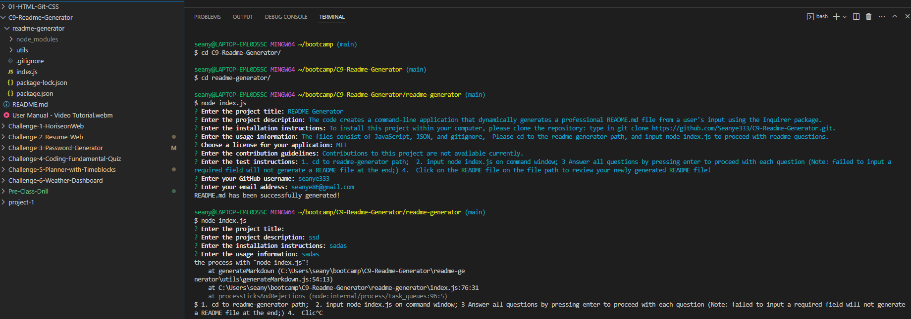

  # README Generator
  
  ## Description
  The code creates a command-line application that dynamically generates a professional README.md file from a user's input using the Inquirer package.
  
  
  
  ## License
  
  
  
  This project is licensed under the [MIT](https://opensource.org/licenses/MIT) license.
  
  
  ## Table of Contents
  - [Installation](#installation)
  - [Usage](#usage)
  - [Contributing](#contributing)
  - [Tests](#tests)
  - [Questions](#questions)
  
  ## Installation
  To install this project within your computer, please clone the repository: type in git clone https://github.com/Seanye333/C9-Readme-Generator.git.
  
  ## Usage
  The files consist of JavaScript, JSON, and gitignore,  Please cd to the readme-generator path, and input node index.js to proceed with readme questions.
  
  ## Contributing
  Contributions to this project are not available currently.
  
  ## Tests
  1. cd to readme-generator path;  2. input node index.js on command window; 3 Answer all questions by pressing enter to proceed with each question (Note: failed to input a required field will not generate a README file at the end;) 4.  Click on the README file on the file path to review your newly generated README file!

  Please watch the following video tutorial for program demostration: https://watch.screencastify.com/v/4qWEx0Izvlwcj5tzQE1r
  
  ## Questions
  For any questions, you can reach me through my [GitHub profile](https://github.com/seanye333) or via email at seanye86@gmail.com.
  